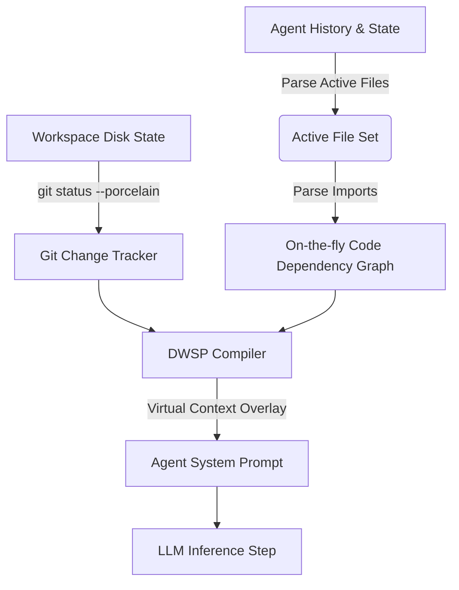

# Dynamic Workspace State Projection (DWSP)
### A Novel Subsystem for Situational Awareness in Agentic Workflows

---

## The Context Engineering Problem in Modern LLM Agents

AI developer agents (like Devin, Aider, and standard Copilots) operate under a key limitation: **they only know what they are explicitly told, or what they manually read using tools.** 

When an agent performs modifications in a complex codebase, it often suffers from **situational blindness**:
* **Git Delta Blindness**: It doesn't automatically know what files are already modified, added, or untracked in the workspace (the current development delta).
* **Dependency Blindness**: If it modifies `utils.ts`, it doesn't know which other files in the active set import or depend on `utils.ts` without manually grepping.
* **Context Overload vs. Amnesia**: Developers must choose between feeding the entire file tree into the context window (causing latency, cost, and distraction) or using standard vector search (which retrieves disjointed chunks lacking structural/temporal relations).

---

## The Solution: Dynamic Workspace State Projection (DWSP)

**DWSP** is a zero-tool-overhead context engineering subsystem designed for agentic runtimes. Instead of requiring the LLM to run manual terminal commands (`git status`, `grep`) or query a database, the runtime **asynchronously constructs a virtual workspace state projection** and overlays it directly onto the system prompt before every step.



---

## Architectural Pillars

### 1. Active Working Set Tracking
DWSP monitors the session's execution history to identify the **active working set**—the precise set of files the agent has read, written, or modified in the current session.

### 2. Live Git delta Syncing
Before each turn, the runtime runs a non-blocking Git delta analysis. It reports exactly what files are modified, added, or untracked. This prevents the agent from making redundant changes or losing track of its own modifications.

### 3. On-the-fly Import Mapping (Dependency Graphing)
For every file in the active working set, the runtime parses import statements (TypeScript, JavaScript, Python) to map out dependency relationships on-the-fly. If file `A` imports file `B`, the agent's system prompt is enriched with this structural link:
> `A.ts` depends on `B.ts`

This gives the agent a "mental map" of code relationships, warning it about potential compilation breaks before they happen.

### 4. Dynamic Injector & De-duplication
The overlay is compiled and injected into the system prompt. It includes a built-in de-duplication guard to ensure the header is never injected twice, keeping token consumption clean and predictable.

---

## Structural Context Layout

When DWSP is active, the agent's system message is dynamically appended with the following structured layout:

```markdown
## DYNAMIC WORKSPACE PROJECTION (DWSP)
Below is the real-time state of your active workspace. Use this to maintain situational awareness.

### Workspace Environment
- **Node Version**: v18.16.0
- **Platform**: win32
- **Root Path**: `C:/Users/srini/Downloads/EverFern/everfern-desktop/apps/desktop`

### Active Git Modifications
- `modified` main/agent/runner/runner.ts [Status: M]
- `untracked` main/agent/runner/workspace-projection.ts [Status: ??]

### Active File Dependency Graph
- `runner.ts` imports:
  - `./graph`
  - `./types`
  - `../tools/computer-use`
```

---

## Expected Benefits & Cognitive Impact

1. **Zero-Tool Cost**: The agent gains full git/dependency awareness without consuming inference steps or tool execution time.
2. **Structural Reasoning**: By understanding the code graph, the agent edits code with higher accuracy and fewer compilation errors.
3. **Delta Focus**: The Git status summary acts as a working memory checkpoint, helping the agent remember what it has already changed and what remains to be done.
