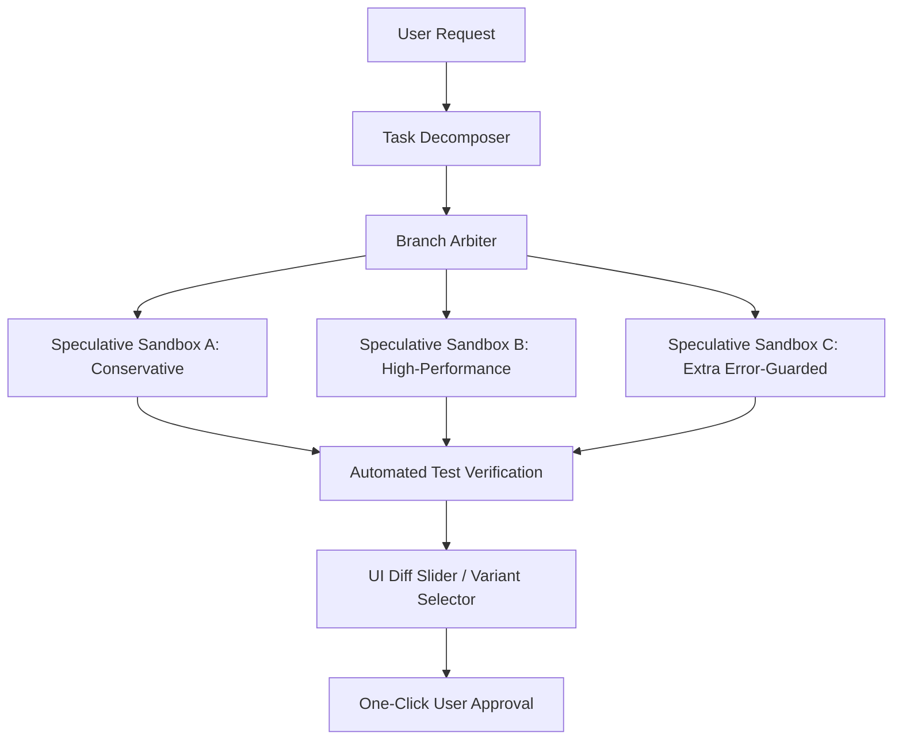

# EverFern Desktop Project Roadmap

This roadmap documents future high-impact features and strategic enhancements planned for EverFern.

---

## Speculative Sandboxed Branching (Multi-Variant Execution)

### Objective
Drastically reduce task completion latency and improve output quality by shifting the agent from serial single-hypothesis executions to concurrent multi-hypothesis sandboxing.

### Proposed Architecture

### Key Deliverables
1. **Lightweight Sandbox Orchestration:**
   - Integrate transient sub-workspaces or lightweight git branches for worker agents.
   - Run parallel workers simultaneously using isolated process/filesystem environments.
2. **Concurrent Task Solver:**
   - Modify the dispatcher to fork the agentic graph state into independent speculative execution tracks.
3. **Variant Selection Interface:**
   - Develop an Electron-native comparison viewer that displays parallel variant diffs side-by-side with build results and test scores.
